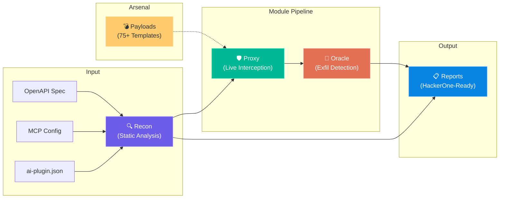

<p align="center">
  
</p>

<p align="center">
  <strong>Find zero-days in GPT Actions & MCP Servers before attackers do.</strong>
</p>

<p align="center">
  <a href="https://github.com/Ak-cybe/llm-plugin-tester/actions/workflows/ci.yml"></a>
  <a href="https://www.python.org/downloads/"></a>
  <a href="LICENSE"></a>
  <a href="https://github.com/Ak-cybe/llm-plugin-tester/stargazers"></a>
</p>

<p align="center">
  <a href="#-quickstart">Quickstart</a> •
  <a href="#-features">Features</a> •
  <a href="#-attack-vectors">Attack Vectors</a> •
  <a href="#-architecture">Architecture</a> •
  <a href="docs/BUG_BOUNTY_GUIDE.md">Bug Bounty Guide</a> •
  <a href="CONTRIBUTING.md">Contributing</a>
</p>

---

## The Problem

LLM plugins (GPT Actions, MCP Servers) are the **new attack surface**. They connect AI models to real APIs with real permissions — and most of them ship with:

- ❌ No authentication
- ❌ Over-declared permissions
- ❌ Unvalidated URL parameters (→ SSRF)
- ❌ Zero protection against data exfiltration

**One malicious prompt can steal AWS credentials, exfiltrate databases, or execute arbitrary code.**

`llm-plugin-tester` is the automated security scanner that catches these vulnerabilities before they hit production.

---

## ⚡ Quickstart

```bash
# Install
pip install -e .

# Scan a GPT Action for vulnerabilities
llm-plugin-tester analyze -t gpt-action -m examples/malicious-gpt-action/ai-plugin.json

# Audit an MCP Server configuration
llm-plugin-tester analyze -t mcp -c examples/vulnerable-mcp-server/mcp-config.json
```

### Example Output

```
┌──────────────────────────────────────────────────────────────────┐
│                    🔍 GPT Action Analysis                        │
├────────────┬────────┬────────────────────────────────────────────┤
│ Endpoint   │ Risk   │ Finding                                    │
├────────────┼────────┼────────────────────────────────────────────┤
│ /*         │ 🔴 HIGH│ No authentication - API publicly accessible│
│ /execute   │ 🔴 HIGH│ Risky params: command, code                │
│ /query     │ 🔴 HIGH│ Risky params: sql                          │
│ /admin/*   │ 🔴 HIGH│ Risky params: file_path                    │
└────────────┴────────┴────────────────────────────────────────────┘
```

---

## ✨ Features

| Module | What It Does | Status |
|--------|-------------|--------|
| 🔍 **Recon** | Parse OpenAPI specs & MCP configs. Flag risky params, weak auth, excessive permissions. | ✅ Stable |
| 🛡️ **Proxy** | `mitmproxy` integration to intercept live tool calls. Detect hallucinated parameters, SSRF, and sensitive data leaks in real-time. | ✅ Stable |
| 💣 **Payloads** | 75+ attack templates: SSRF, markdown exfiltration, prompt injection, tool chaining, LangGrinch RCE, MCP abuse. | ✅ Stable |
| 📡 **Oracle** | FastAPI listener that catches and logs data exfiltration attempts. Deploy on your VPS, inject payloads, watch the secrets flow in. | ✅ Stable |
| 📋 **Reports** | HackerOne-ready report templates with CVSS scoring. Copy, paste, submit, get paid. | ✅ Stable |

---

## 🎯 Attack Vectors

> Full deep-dive: [docs/ATTACK_VECTORS.md](docs/ATTACK_VECTORS.md)

| Vector | Severity | What We Detect |
|--------|----------|---------------|
| **SSRF** | 🔴 Critical | AWS/GCP metadata theft, internal service enumeration, `file:///` reads |
| **Markdown Exfiltration** | 🔴 High | Zero-click data theft via rendered `` |
| **Hallucinated Parameters** | 🟠 High | LLM invents `is_admin: true` — backend blindly accepts it |
| **Tool Chaining** | 🔴 Critical | READ database → EMAIL to attacker, no user approval |
| **LangGrinch RCE** | 🔴 Critical | Deserialization via `lc` key → arbitrary code execution |
| **Indirect Prompt Injection** | 🟠 High | Poisoned data sources hijack model behavior |
| **MCP Abuse** | 🔴 Critical | Root filesystem access, shell execution, CORS wildcards |

---

## 🏗️ Architecture



---

## 🔬 How It Works

### 1. Static Recon
```python
from llm_plugin_tester.recon import OpenAPIParser

parser = OpenAPIParser("path/to/openapi.yaml")
parser.parse()
findings = parser.analyze()

for f in findings:
    print(f"{f.risk_level}: {f.endpoint} — {f.reason}")
```

### 2. Live Interception
```python
from llm_plugin_tester.proxy import InterceptionProxy

proxy = InterceptionProxy(openapi_schema=schema)
# Integrates with mitmproxy to detect hallucinated params,
# SSRF attempts, and sensitive data in real-time
```

### 3. Exfiltration Oracle
```bash
# Deploy on your VPS — catches data theft attempts
llm-plugin-tester oracle start --host 0.0.0.0 --port 8080

# Inject: 
# Watch: 🚨 EXFILTRATION DETECTED — severity: HIGH
```

### 4. Generate Payload Suite
```python
from llm_plugin_tester.payloads import generate_ssrf_test_suite

tests = generate_ssrf_test_suite(target_param="fetch_url")
# Returns 24 SSRF payloads across 6 categories
# AWS metadata, GCP metadata, K8s secrets, file reads...
```

---

## 💰 For Bug Bounty Hunters

This tool was built for you. See the full [Bug Bounty Guide](docs/BUG_BOUNTY_GUIDE.md).

| What You Find | Expected Payout |
|---------------|----------------|
| SSRF with cloud creds | $5,000 — $20,000 |
| Markdown exfil (API keys) | $2,000 — $10,000 |
| Tool chaining (no approval) | $3,000 — $12,000 |
| Hallucinated params (privesc) | $1,500 — $8,000 |

**Programs accepting LLM vulns:** OpenAI, Anthropic, Google (Gemini), Microsoft (Copilot)

---

## 📦 Installation

### Basic (Recon + Oracle + Payloads)
```bash
pip install -e .
```

### With Proxy (mitmproxy integration)
```bash
pip install -e ".[proxy]"
```

### Development
```bash
git clone https://github.com/Ak-cybe/llm-plugin-tester.git
cd llm-plugin-tester
pip install -e ".[dev]"
pytest tests/ -v
```

---

## 🗺️ Roadmap

- [x] Module 1: Static Recon (OpenAPI + MCP)
- [x] Module 2: Interception Proxy
- [x] Module 3: Attack Payloads Library
- [x] Module 4: Validation Oracle
- [x] Module 5: Report Templates
- [ ] Module 6: Promptfoo/Garak integration
- [ ] Module 7: Auto-fuzzer with coverage tracking
- [ ] CI/CD security gate (GitHub Action)

---

## 🤝 Contributing

Contributions welcome! See [CONTRIBUTING.md](CONTRIBUTING.md) for guidelines.

**High-impact areas:**
- New detectors and attack payloads
- Promptfoo/Garak integration
- Real-world exploitation walkthroughs

---

## 📄 License

[MIT](LICENSE) — Use it, break things, secure the ecosystem.

---

## ⚠️ Legal Disclaimer

This tool is for **authorized security testing only**. Always obtain explicit permission before testing third-party systems. The authors are not responsible for misuse. See [SECURITY.md](SECURITY.md) for responsible disclosure guidelines.

---

<p align="center">
  <sub>Built for the bug bounty community. If this tool helps you find a vulnerability, consider starring ⭐ the repo.</sub>
</p>
